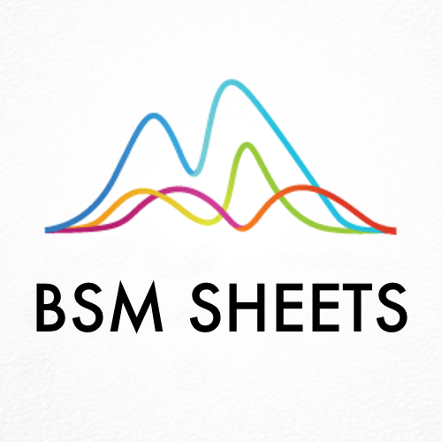

<div id="top"></div>

<!-- PROJECT SHIELDS -->
<!--
*** I'm using markdown "reference style" links for readability.
*** Reference links are enclosed in brackets [ ] instead of parentheses ( ).
*** See the bottom of this document for the declaration of the reference variables
*** for contributors-url, forks-url, etc. This is an optional, concise syntax you may use.
*** https://www.markdownguide.org/basic-syntax/#reference-style-links
-->
[![Contributors][contributors-shield]][contributors-url]
[![Forks][forks-shield]][forks-url]
[![Stargazers][stars-shield]][stars-url]
[![Issues][issues-shield]][issues-url]
[![MIT License][license-shield]][license-url]


<!-- PROJECT LOGO -->
<br />
<div align="center">
  <a href="https://github.com/BardsWork/bsm-sheets">
    
  </a>

<h3 align="center">Get the Greeks inside your Sheets!</h3>

  
[View Demo][demo-url] · [Report Bug][issues-url] · [Request a Feature][issues-url]

[Explore the docs »][docs-url]
</div>


<!-- TABLE OF CONTENTS -->
<details>
  <summary>Table of Contents</summary>
  <ol>
    <li>
      <a href="#about-the-project">About The Project</a>
      <ul>
        <li><a href="#resources">Resources</a></li>
      </ul>
    </li>
    <li>
      <a href="#getting-started">Getting Started</a>
      <ul>
        <li><a href="#prerequisites">Prerequisites</a></li>
        <li><a href="#installation">Installation</a></li>
      </ul>
    </li>
    <li><a href="#usage">Usage</a></li>
    <li><a href="#contributing">Contributing</a></li>
    <li><a href="#license">License</a></li>
    <li><a href="#contact">Contact</a></li>
  </ol>
</details>


<!-- ABOUT THE PROJECT -->
## About The Project

[![Product Name Screen Shot][product-screenshot]](https://example.com)

The inspiration for this App Scripts was my curiosity in simulating different option pricing scenarios to better understand contract pricing. While calculating BSM is fairly trivial, I wanted access to functions so I can compare different scenarios, for example, how much would implied volatility need to increase for the option to react similarly if the underlying increased $1. 

If that sounds interesting, please read the docs to understand the function and their limitations, which there are a lot of. However, for simple scenario comparison, the data is adaquate.


<!-- Here's a blank template to get started: To avoid retyping too much info. Do a search and replace with your text editor for the following: `github_username`, `repo_name`, `twitter_handle`, `linkedin_username`, `email`, `email_client`, `project_title`, `project_description` -->

<p align="right">(<a href="#top">back to top</a>)</p>

### Resources

All functions were written within Google App Scripts and have to be added manually to the desired sheet.
* [Google App Scripts](https://developers.google.com/apps-script)

The following papers were used to create the functions:
* [Theory of rational Option Pricing - Merton](http://www.people.hbs.edu/rmerton/theory%20of%20rational%20option%20pricing.pdf)

The folowing link helped in the original creation of the script:
* [Excel implementation of Black-Scholes](https://excelatfinance.com/xlf17/xlf-black-scholes-google-sheets.php)

If you need a general overview of option greeks:
* [CBOE - Learning the Greeks: An Expert's Perspective](https://www.cboe.com/insights/posts/learning-the-greeks-an-experts-perspective/#:~:text=What%20Are%20Option%20Greeks%3F,volatility%2C%20and%20even%20interest%20rates.)


<p align="right">(<a href="#top">back to top</a>)</p>


<!-- GETTING STARTED -->
## Getting Started

If you have never worked with Google App Scripts, don't worry, its straight forward and there a lot of documentation on the internet. So much so, that instead of giving step-by-step instructions, I'm going to link to some of the best guides I have found.

#### What is Google App Scripts
- [Google App Scripts Home](https://developers.google.com/apps-script)
- [Beginner's Guide](https://www.benlcollins.com/apps-script/google-apps-script-beginner-guide/)
- [Custom Function Documentation](https://spreadsheet.dev/writing-custom-functions-for-google-sheets)

#### How to Add App Scripts to Sheets
- [Comprehensive guide](https://spreadsheetpoint.com/google-sheets-script/)
- [Video Tutorial](https://www.youtube.com/watch?v=Nd3DV_heK2Q)


------

### Prerequisites

This is an example of how to list things you need to use the software and how to install them.
* npm
  ```sh
  npm install npm@latest -g
  ```

### Installation

1. Get a free API Key at [https://example.com](https://example.com)
2. Clone the repo
   ```sh
   git clone https://github.com/BardsWork/bsm-sheets.git
   ```
3. Install NPM packages
   ```sh
   npm install
   ```
4. Enter your API in `config.js`
   ```js
   const API_KEY = 'ENTER YOUR API';
   ```

<p align="right">(<a href="#top">back to top</a>)</p>


<!-- USAGE EXAMPLES -->
## Usage

Use this space to show useful examples of how a project can be used. Additional screenshots, code examples and demos work well in this space. You may also link to more resources.

_For more examples, please refer to the [Documentation](https://example.com)_

<p align="right">(<a href="#top">back to top</a>)</p>


<!-- CONTRIBUTING -->
## Contributing

> Please see the [open issues](https://github.com/BardsWork/bsm-sheets/issues) for a full list of proposed features (and known issues).

Contributions are what make the open source community such an amazing place to learn, inspire, and create. Any contributions you make are **greatly appreciated**.

If you have a suggestion that would make this better, please fork the repo and create a pull request. You can also simply open an issue with the tag "enhancement".
Don't forget to give the project a star! Thanks again!

1. Fork the Project
2. Create your Feature Branch (`git checkout -b feature/AmazingFeature`)
3. Commit your Changes (`git commit -m 'Add some AmazingFeature'`)
4. Push to the Branch (`git push origin feature/AmazingFeature`)
5. Open a Pull Request

<p align="right">(<a href="#top">back to top</a>)</p>


<!-- LICENSE -->
## License

Distributed under the MIT License. See `LICENSE.txt` for more information.

<p align="right">(<a href="#top">back to top</a>)</p>


<!-- CONTACT -->
## Contact

If you'd like to get in contact, the best way would probably be [twitter][@twitter-handle] or [open an issue][issues-url].


<p align="right">(<a href="#top">back to top</a>)</p>


<!-- MARKDOWN LINKS & IMAGES -->
<!-- https://www.markdownguide.org/basic-syntax/#reference-style-links -->
[contributors-shield]: https://img.shields.io/github/contributors/BardsWork/bsm-sheets.svg?style=for-the-badge
[contributors-url]: https://github.com/BardsWork/bsm-sheets/graphs/contributors
[forks-shield]: https://img.shields.io/github/forks/BardsWork/bsm-sheets.svg?style=for-the-badge
[forks-url]: https://github.com/BardsWork/bsm-sheets/network/members
[stars-shield]: https://img.shields.io/github/stars/BardsWork/bsm-sheets.svg?style=for-the-badge
[stars-url]: https://github.com/BardsWork/bsm-sheets/stargazers
[issues-shield]: https://img.shields.io/github/issues/BardsWork/bsm-sheets.svg?style=for-the-badge
[issues-url]: https://github.com/BardsWork/bsm-sheets/issues
[license-shield]: https://img.shields.io/github/license/BardsWork/bsm-sheets.svg?style=for-the-badge
[license-url]: https://github.com/BardsWork/bsm-sheets/blob/main/LICENSE
[docs-url]: https://github.com/BardsWork/bsm-sheets
[demo-url]: https://docs.google.com/spreadsheets/d/e/2PACX-1vQD9kuzgQscJvd3i1dpvPIv7z4UCZ6HyHy3v_VGM449rp1JgG7No2_i8QV4IW87M-tIllyZCC6ng0FX/pubhtml?gid=4&single=true
[product-screenshot]: images/screenshot.png
[@twitter-handle]: https://twitter.com/bardswork
[@github-url]: https://github.com/BardsWork
